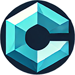

<!-- Improved compatibility of back to top link: See: https://github.com/othneildrew/Best-README-Template/pull/73 -->
<a id="readme-top"></a>
<!--
*** Thanks for checking out the Best-README-Template. If you have a suggestion
*** that would make this better, please fork the repo and create a pull request
*** or simply open an issue with the tag "enhancement".
*** Don't forget to give the project a star!
*** Thanks again! Now go create something AMAZING! :D
-->

<!-- PROJECT LOGO -->
<br />
<div align="center">
  <a href="https://github.com/syanification/Crystal_v3">
    
  </a>

  <h3 align="center">Crystal</h3>

  <p align="center">
    The AI Powered Inbox Summarizing Chrome Extension!
    <br />
    <a href="https://github.com/syanification/Crystal_v3"><strong>Explore the project »</strong></a>
    <br />
    
<div>
</br>
</div>
    <a href="https://www.youtube.com/watch?v=jwB-AQFcZHs">View Demo</a>
    ·
    <a href="https://github.com/syanification/Crystal_v3/issues/new?labels=bug&template=bug-report---.md">Report Bug</a>
    ·
    <a href="https://github.com/syanification/Crystal_v3/issues/new?labels=enhancement&template=feature-request---.md">Request Feature</a>
  </p>
</div>


<!-- TABLE OF CONTENTS -->
<details>
  <summary>Table of Contents</summary>
  <ol>
    <li>
      <a href="#about-the-project">About The Project</a>
      <ul>
        <li><a href="#built-with">Built With</a></li>
      </ul>
    </li>
    <li>
      <a href="#getting-started">Getting Started</a>
      <ul>
        <li><a href="#prerequisites">Prerequisites</a></li>
        <li><a href="#installation">Installation</a></li>
      </ul>
    </li>
    <li><a href="#usage">Usage</a></li>
    <li><a href="#license">License</a></li>
    <li><a href="#contact">Contact</a></li>
    <li><a href="#acknowledgments">Acknowledgments</a></li>
  </ol>
</details>


<!-- ABOUT THE PROJECT -->
## About The Project

[![Preview Screen Shot][product-screenshot]](https://github.com/syanification/Crystal_v3)

Crystal uses the new onboard Gemini Summary API to deliver a summary of the users current inbox page. It's as simple as installing the extension and watching the magic happen!

<p align="right">(<a href="#readme-top">back to top</a>)</p>


### Built With

This section should list any major frameworks/libraries used to bootstrap your project. Leave any add-ons/plugins for the acknowledgements section. Here are a few examples.

* Javascript
* Gmail-js
* Summarization API for Gemini Nano

<p align="right">(<a href="#readme-top">back to top</a>)</p>


<!-- GETTING STARTED -->
## Getting Started

How to try for yourself:

### Prerequisites

* npm
  ```sh
  npm install npm@latest -g
  ```
* Google chrome with Summarization AI support
* Gmail

### Installation
1. Clone the repo
   ```sh
   git clone https://github.com/syanification/Crystal_v3.git
   ```
2. Install NPM packages
   ```sh
   npm install
   ```
3. Build the unpacked extension
   ```js
   npm run build
   ```
4. Navigate to `chrome://extensions` in your browser
    
5. Enable developer mode under chrome extensions
6. Click load unpacked extension
7. Select the project root directory
8. You're ready to start summarizing!

<p align="right">(<a href="#readme-top">back to top</a>)</p>


<!-- USAGE EXAMPLES -->
## Usage

Simply open up any gmail inbox in your browser and await for summariziation!


<p align="right">(<a href="#readme-top">back to top</a>)</p>


<!-- LICENSE -->
## License

Distributed under the MIT License. See `LICENSE.md` for more information.

<p align="right">(<a href="#readme-top">back to top</a>)</p>


<!-- CONTACT -->
## Contact

Riley Roberts - syanification@gmail.com

Project Link: [https://github.com/syanification/Crystal_v3](https://github.com/syanification/Crystal_v3)

<p align="right">(<a href="#readme-top">back to top</a>)</p>


<!-- ACKNOWLEDGMENTS -->
## Acknowledgments

I would like to thank the following resources, without them this project would not have been possible.

* [Choose an Open Source License](https://choosealicense.com)
* [Gmail.js Library](https://github.com/KartikTalwar/gmail.js/)
* [Css Generators](https://css-generators.com/)
* [Best README Template](https://github.com/othneildrew/Best-README-Template)

<p align="right">(<a href="#readme-top">back to top</a>)</p>


<!-- MARKDOWN LINKS & IMAGES -->
<!-- https://www.markdownguide.org/basic-syntax/#reference-style-links -->
[product-screenshot]: images/preview.png
